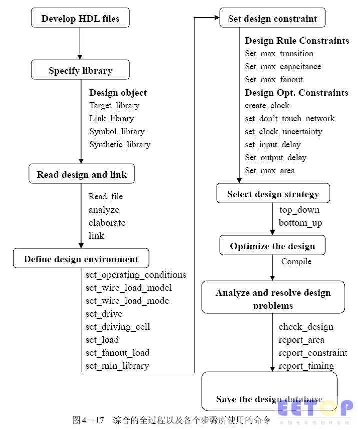

# Linux_EDA_Op

Record the EDA tool operation.

记录方式还是先在README中记录，然后在整理分档；

查看发行版本：https://blog.csdn.net/szr4630/article/details/79613267

```shell
lsb_release -a
```

centos 7.8;

gedit 显示行号：https://www.cnblogs.com/wq242424/p/6151461.html

快捷键：

Super+R ：打开终端；

Super+J：打开计算器；


Verdi：

https://blog.csdn.net/kevindas/article/details/79008106

需要指定 -P

```bash
vcs	-full64 *.v \
	-debug_all \
	-R \
	-timescale=1ns/1ps \
	-P	/home/eda/synopsys/verdi/Verdi_O-2018.09-SP2/share/PLI/VCS/linux64/novas.tab \
		/home/eda/synopsys/verdi/Verdi_O-2018.09-SP2/share/PLI/VCS/linux64/pli.a 
	-l compile.log
```

这个VCS使用写的很详细：

https://zhuanlan.zhihu.com/p/127335447


PrimeTime

https://wenku.baidu.com/view/676a1337d5bbfd0a785673a4.html

https://www.jianshu.com/p/30769ce8925a

在文档中找到一个文件：PrimeTime_PX_Tutorials

PT使用中文教程：https://wenku.baidu.com/view/b33455d4360cba1aa811da43.html

所以，需要整理一个Project，做完Sim，DC，和primetime；

## 2021-03-06

linux sed 命令 https://www.runoob.com/linux/linux-comm-sed.html

Linux sed 命令是利用脚本来处理文本文件。

sed 可依照脚本的指令来处理、编辑文本文件。

Sed 主要用来自动编辑一个或多个文件、简化对文件的反复操作、编写转换程序等。

VCS命令行中的-f,-F以及-file参数区别 https://blog.csdn.net/immeatea_aun/article/details/89155349

命令行使用 vcs -full64 -h获得manual可知，三者区别不大，详情如下：

-f <filename>

指定包含源文件和编译时选项的路径名列表的文件。
-F <filename>

与-f选项相同，但允许您指定文件的路径，文件中列出的源文件不必是绝对路径名。
-file filename

此选项适用于使用-f或-F选项指定的文件中的条目可能遇到的问题。 此文件可以包含更多编译时选项和不同类型的文件。 它可以包含用于控制编译和PLI选项和目标文件的选项。 您还可以在此文件中使用转义字符和元字符，例如$，`和！ 等

VCS 常用命令 https://blog.csdn.net/immeatea_aun/article/details/79789838

**需要严格指定file_list中的文件路径以及文件名称，\*.v在verdi命令行操作时候，会无法加载source文件；**

## 压缩

2、tar 命令
tar可以用来打包文件，还可以把特定目录下的全部文件打包成一个总的文件，打包的同时还可以同时使用gzip的功能进行压缩。如果只执行tar命令则压缩后

的文件后缀名是.tar,如果执行gzip命令则压缩后的文件名后缀名是.gz。如果同时执行两个命令则压缩后的文件名是.tar.gz或者简写为.tgz。

比如：tar -zcvf boot.tgz /boot #将/boot目录整合压缩成boot.tgz

参数说明：-z:使用gzip压缩；-c 创建压缩文件；-v 是显式当前被压缩的文件，-f 指使用文件名即boot.tgz。

解压命令：tar -zxvf boot.tgz 

参数说明：-x 是解压的意思

如果解压的同时指定解压目录可以执行以下命令：

tar -zxvf boot.tgz -C /home/dir #需要使用-C参数，后面跟上文件路径。

Linux cp 命令
Linux 命令大全 Linux 命令大全

Linux cp（英文全拼：copy file）命令主要用于复制文件或目录。

语法
cp [options] source dest
或

cp [options] source... directory
参数说明：

-a：此选项通常在复制目录时使用，它保留链接、文件属性，并复制目录下的所有内容。其作用等于dpR参数组合。
-d：复制时保留链接。这里所说的链接相当于Windows系统中的快捷方式。
-f：覆盖已经存在的目标文件而不给出提示。
-i：与-f选项相反，在覆盖目标文件之前给出提示，要求用户确认是否覆盖，回答"y"时目标文件将被覆盖。
-p：除复制文件的内容外，还把修改时间和访问权限也复制到新文件中。
-r：若给出的源文件是一个目录文件，此时将复制该目录下所有的子目录和文件。
-l：不复制文件，只是生成链接文件。
实例
使用指令 cp 将当前目录 test/ 下的所有文件复制到新目录 newtest 下，输入如下命令：

$ cp –r test/ newtest          
注意：用户使用该指令复制目录时，必须使用参数 -r 或者 -R 。

DC的gatecount = total area / the area of NAND2;

把2个PMOS和2个NMOS看成一个面积单元，也就是一个2输入与非门为一个单元，所以DC report_area，并找到对应元件库中的2输入与非门的面积大小（我找不到）；
https://blog.csdn.net/chevroletss/article/details/6082960

## 2021-04-09
1.zip命令
zip -r myfile.zip ./*
将当前目录下的所有文件和文件夹全部压缩成myfile.zip文件,－r表示递归压缩子目录下所有文件.

2.unzip命令
unzip -o -d /home/sunny myfile.zip
把myfile.zip文件解压到 /home/sunny/
-o:不提示的情况下覆盖文件；
-d:-d /home/sunny 指明将文件解压缩到/home/sunny目录下；

3.其他
zip -d myfile.zip smart.txt
删除压缩文件中smart.txt文件
zip -m myfile.zip ./rpm_info.txt

向压缩文件中myfile.zip中添加rpm_info.txt文件
-------------------------------------------------------------------------------


要使用 zip 来压缩文件，在 shell 提示下键入下面的命令：

zip -r filename.zip filesdir
在这个例子里，filename.zip 代表你创建的文件，filesdir 代表你想放置新 zip 文件的目录。-r 选项指定你想递归地（recursively）包括所有包括在 filesdir 目录中的文件。
要抽取 zip 文件的内容，键入以下命令：
unzip filename.zip
你可以使用 zip 命令同时处理多个文件和目录，方法是将它们逐一列出，并用空格间隔：

zip -r filename.zip file1 file2 file3 /usr/work/school 
上面的命令把 file1、file2、 file3、以及 /usr/work/school 目录的内容（假设这个目录存在）压缩起来，然后放入 filename.zip 文件中。

---

## 使用lc将lib转换为db

### 环境
dc 2015.06版之后，自身就不再支持library compiler，需要自行安装library compiler。

### 步骤
$ lc_shell
lc_shell> read_lib S011HDSP_X32Y8D32_BW_SS_1.08_125.lib
lc_shell> write_lib -format db S011HDSP_X32Y8D32_BW_SS_1.08_125 -output S011HDSP_X32Y8D32_BW_SS_1.08_125.db
lc_shell> quit
————————————————
版权声明：本文为CSDN博主「uvm_ydd」的原创文章，遵循CC 4.0 BY-SA版权协议，转载请附上原文出处链接及本声明。
原文链接：https://blog.csdn.net/uvm_ydd/article/details/89709990

https://www.cnblogs.com/IClearner/p/11008940.html
	
## 常用的命令行
	dc_shell | tee run.log
	
	report_area -hierarchy 可以显示每个模块的使用面积信息

 脚本内容
```tcl
# set search path
set_app_var search_path [list * /home/user/junkai_liu/Desktop/SRS5025/decoder/test1_00]

# set dc library
set_app_var link_library [list  ss_1v62_125c.db]

set_app_var target_library [list ss_1v62_125c.db]

set_app_var symbol_library [list ss_1v62_125c.db]

sh rm -rf mapped
sh mkdir mapped

set_svf ./mapped/rld_top.svf

set compile_seqmap_propagate_constants false

# read verilog file
analyze -format verilog [list data_adj.v \
                                rld_core.v \
                                rld_top.v]

elaborate rld_top
# set current design
# current_design rld_top

link
```
link 之后的结果为1，说明环境设置的是正确的，如果link之后的结果为0，说明环境有问题
	
含有parameter的实例化，需要使用
```tcl
analyze -format verilog [list data_adj.v\
							rld_core.v\
							rld_top.v]
elavorate rld_top
```
进行source文件的读取。

http://blog.eetop.cn/blog-422523-28881.html



analyzer是分析HDL的源程序并将分析产生的中间文件存于work（用户可以自己指定）的目录下

elaborate则在产生的中间文件中生成verilog的模块或者VHD的实体；

缺省情况下，elaborate读取的是work目录中的文件

当前读取完所要综合的模块后，需要使用link命令将读到DC存储区中的模块或实体连接起来

注意：如果在使用link命令后，出现unresolved design reference的警告信息，需要重新读取该模块，或者在.synopsys_dc.setup文件中添加link_library，告诉DC到库中去找这些模块，同时还要注意search_path中的路径是否指向该模块或单元电路所在的目录

link命令执行后，DC就将模块按照RTL级或门级的描述将电路连接起来，之后的各种限制条件就可以对该电路的顶层模块施加；


# [Linux中在当前目录下查找某个文件](https://www.cnblogs.com/wtjqs/p/10416654.html)

https://www.cnblogs.com/wtjqs/p/10416654.html

在eetop上下载到了Design Compiler User Guide，看一看综合的详细文件；


Synthesis = Translation + Logic Optimization + Gate Mapping

23、Design Compiler 的Topographical Mode相比Wire Load Models有什么优势？
线负载模型（WLM）是基于工艺厂的数据统计，而不是特定于自己的设计。在深亚微米（UDSM）设计中，互连寄生参数对路径延迟有很大的影响 ，WLM是不够准确的。
Topographical Mode使用placement算法来估计线延时，提供和实际物理布局更好的时序相关性。
Topographical Mode 除了逻辑库之外，还需要物理库（Milkyway）

------------------------------------------------
版权声明：本文为CSDN博主「数字芯片实验室」的原创文章，遵循CC 4.0 BY-SA版权协议，转载请附上原文出处链接及本声明。
原文链接：https://blog.csdn.net/iNostory/article/details/86751200


5、Design Compiler 综合过程中 “link” 命令完成了什么功能？
link 是 Design Compiler ”resolve”设计中例化模块的过程。Design Compiler 通过变量 “link_library” 指定例化模块库的位置，和 target_library 一样，默认为 your_library.db。建议显式地使用 link 命令，否则工具可能带着 “unresolved references” 进行综合，产生没有意义的结果，同时浪费时间。

## 时序约束报告

report constraint

report constraint -all_violators

report timing

report timing -significant_digits 6 查看数据小数点后面6位

时序分析之slack：https://www.cnblogs.com/chenwu128/archive/2011/12/12/2285423.html

fpga时序分析和slack(SOC) (Quartus II)

https://blog.csdn.net/gtkknd/article/details/52824855


https://blog.csdn.net/sinat_29862967/article/details/111225986

报告开始显示了路径的起点，路径终点，路径组名和路径检测的类型。此例中，路径检测类型为max，意味着最大的延时或者setup check，若是min则是最小的延时或者hold check

下面一个大表显示了从起点到终点之间的一个个点的延时值。纵列有三个标识， Point， Incr和 Path，分别表示了路径中的各个点，此点所需要的延时和从起点一直累积到此点的延时值。（一般是6列：point、fanout扇出值、trans传输延时、incr器件延时、path、attributes延时类型）

**星号(*)表示了使用了SDF文件中的延时值，r和f表示 上升或者下降沿。**

> 标准延迟文件SDF：主要包含了网表中所有器件的延迟信息，用于时序仿真；通常情况下，在仿真过程中会使用由PT报出的sdf，因为PT会结合后端工具，生成延迟更为精确的sdf文件。

时序约束对电路的要求：

- 综合工具现在不能很好的支持一步电路，甚至不支持异步电路；
- single clock，single cycle，单个时钟，单沿触发，不要一会儿posedge，一会儿negedge；

可以用下面命令对除时钟以外的所有输入端口设置约束：
set_input_delay -max 3.5 -clock CLK [romove_from_collection [all_inputs] [get_ports CLK]]；#表示从所有输入端口中除掉时钟CLK

create_clock -period 10 [get_ports CLK]

set_input_delay -max 6 -clock CLK [all_inputs]

remove_input_delay [get ports CLK] ;#时钟不需要输入延迟的约束

set_output_delay -max 4 -clock CLK [all_outputs]


set_clock_uncertainty：对时钟的偏移与抖动进行建模，也就是对时钟的偏差进行建模。

set_ clock_ uncertainty -rise 0.2 -fall 0.5 [get_clocks CLK]

