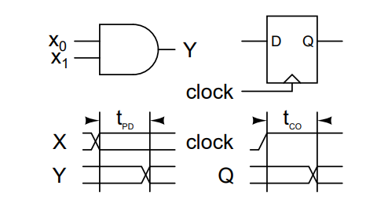
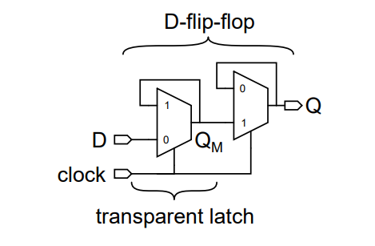
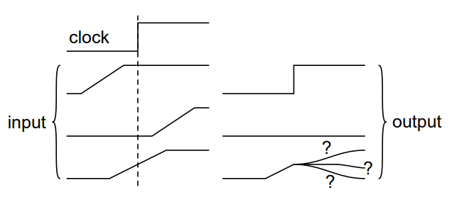
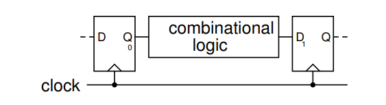
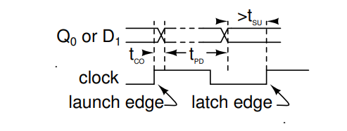
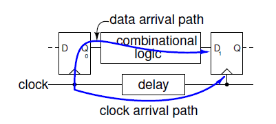
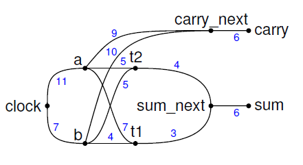
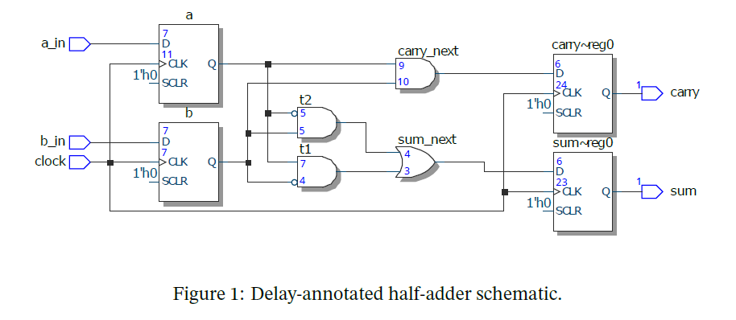

http://www.ece.ubc.ca/~edc/7660.jan2018/

# 静态时序分析（Static Timing Analysis）

本文主要讲述怎么样使用静态时序分析来确保数字设计中遇到的时序约束。经过本文你应该会了解讲座中定义的术语，通过带delay注释的原理图学会计算建立时间和保持时间。

## 介绍

时钟信号以及信号的建立和保持在规格中需要进行时序约束。满足这些时序约束通常与确保设计上逻辑正确一样困难。

可靠的操作要求设计人员正确指定时序约束并修改设计直到满足约束。

### 传播延时（Propagation Delays）

传播延时，t~PD~，指从组合逻辑电路输入端改变到输出端改变的延时。

时钟到输出延时，t~CO~，指从触发器时钟输入上升沿到触发器Q端输出改变的延时。

这些延时是需要对相互连接的晶体管间的寄生电容充电的引起的。

上述时序框图中的平行线表明信号维持再高电平或低电平，交叉线表明信号改变。

### 亚稳态，建立和保持时间（Metastability，Setup and Hold Times）

通常认为以下边沿触发的D触发器为实现：

当时钟输入为“0”时，第一个多路复用器的输出跟随输入——这个锁存器是“透明的”。当时钟输入为“1”时，第一个多路复用器的输出级反馈到输入端并维持那个电平。

这是一个”master-slave“触发器；当时钟为0时，第二个，”slave”锁存器维持前面一个锁存器的值。

当时钟从0到1变化时，如果锁存器的输出端为逻辑阈值电压，那么多路复用器可能无法决定反馈的信号为0还是为1。多路复用器的输出会维持在一个不确的电平，并且时间比t~CO~ 长得多。这种行为被叫做“亚稳态”，并可能导致电路工作不可靠。

为了避免亚稳态，必须确保锁存器输入电压维持足够长时间的有效电平，以便于驱动锁存器输出端为有效电平。这段需要的时间就被称为“setup”时间，t~SU~ 。

输入电平必须维持在一个正确的电平，指导多路复用器已经完全切换。这段时间通常室间隔短的多的时间——一般为0，这段时间被称为”hold“时间，t~H~。

### 同步设计（Synchronous Design）

为了避免亚稳态产生，几乎所有的数字电路设计都是“同步的”。这些电路设计由边沿触发的触发器和在这些触发器之间的组合逻辑电路组成。

通过这些确定组合逻辑的传输延时可以满足建立和保持时间的需求，我们可以避免出现亚稳态的产生。

下面的时序图表明了每个触发器时钟边沿与输入输出有效时间的关系。

途中的 launch edge 和latch edge 怎么理解？

Q段在时钟上升沿后的t~CO~ 后时间内改变。

t~PD~ 时间之后，右边触发器的D输入将会输入一个有效的（正确的）逻辑电平。这至少要维持t~SU~ 时间指导时钟的下一个上升沿到来。这个电平在改变之前也必须要维持至少t~H~  时间。

上图确定了两个时钟边沿，即“launch”和“latch”边沿。在本例中时钟边沿时由稳定的时钟周期区分。然而，由于相互间的延时不同，时钟边沿可能在不同的时间到来。这就被称为“时钟歪斜 clock skew”。两个时钟的频率也可能不同或在下降沿锁存。

这种建立时间区分于芯片I/O的建立和保持时间，通常被称为“library”或者“micro”建立时间。

## 静态时序分析（Static Timing Analysis）

### 时序路径（Timing Paths）

为了避免亚稳态，我们必须比较数据路径中的传输延时以及时钟路径中的传输延时，如下图所示：

从发射时钟边沿到数据在D触发器输入端这段时间被称为数据有效时间。从发射时钟边沿到锁存始终边沿的这段时间被称为时钟到达时间。t~CO~ 和t~PD~ 延时涵盖了这些内部连接的延时。

### 时序网表（Timing Netlists）

值得注意的是只有时钟开始输入（或者芯片的输入引脚，被称为“input port”）或者触发器末端的D输入（或者芯片的输出端口）这样的时序路径需要分析。

然而，从时钟道一个特定的D输入端，并不只有一个路径。例如，可以参考下图中的半加器。图中在下一个输入引脚的输入端的数字，表示从输入端到输出端的延时，包括内部链接到输入端的延时。

静态时序分析的数据结构是一个直接图示，其中每个节点代表一个引脚。边沿代表了标注的传播延时（包括门和内部连接）延时。下图每个节点代表一个输出，边沿上的数字代表延时。

Note：这些并不是真实的数字，这里使用接近的数字简化运算。

这本例中，只有一个时钟`clock` ，并且所有的路径起点在`clock` 。有四个触发器，但这里我们只分析`carry` 和`sum` 。

从输入到输出，沿着数据路径累加延时，它们分别是：

- `carry.D(6) + carry_next(9) + a.clk(11) = 26`

- `carry.D(6) + carry_next(10) + b.clk(7) = 23`
- `sum.D(6) + sum_next(4) + t2(5) + a.clk(11) = 26`
- `sum.D(6) + sum_next(4) + t2(5) + b.clk(11) = 22`
- `sum.D(6) + sum_next(3) + t1(7) + a.clk(11) = 27`

练习1：

### 时序约束算法（STA 算法）

## Closing Timing

## PVT and Corners

## Asynchronous Clocks and Inputs

## Timing Simulations

